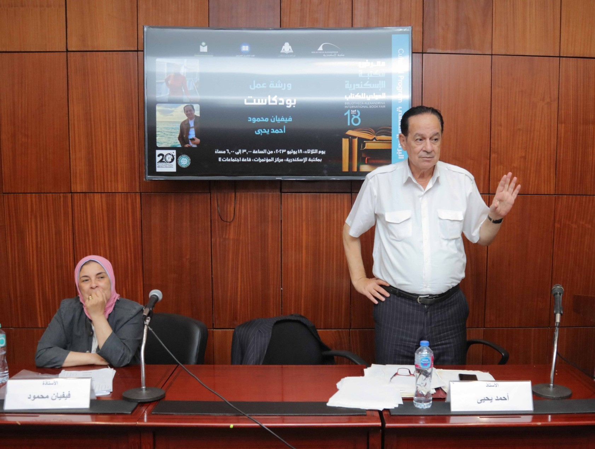
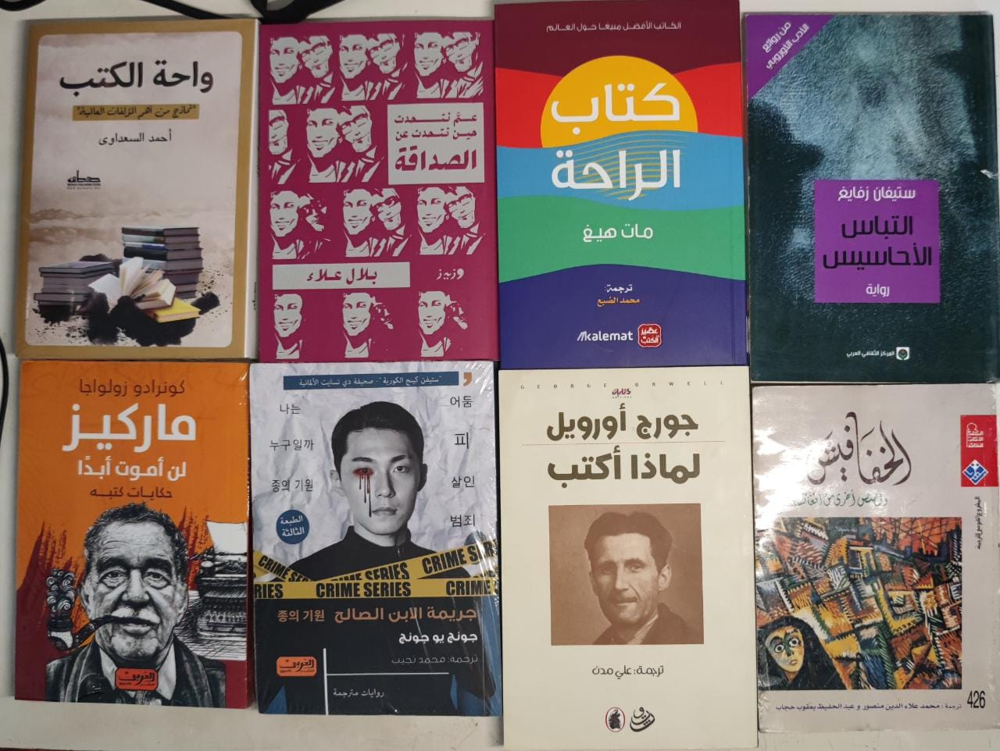

معرض مكتبة الإسكندرية الدولي للكتاب بدأ دورته الـ18 من يوم 12 يوليو ويستمر حتى 26 يوليو. فاقررت أزبط يوم وأخطف رجلي صد رد ألقي نظرة عليه وقد تقرر أن يكون هذا اليوم هو يوم الثلاثاء 18 يوليو.

وصلت الإسكندرية على الساعة 11:30 صباحًا، فطرت سريعًا واتجهت مباشرةً على المعرض.

عدد دور النشر المعلن رسميّا كان حوالي 46 دار + 14 دار موجودين في جناح الطفل. ولكن على أرض الواقع فا كل دار نشر كان نازل معاها كذا دار غيرها، كمثال دار نشر الكرمة كان معاها 4 دور نشر غيرها في نفس البارتيشن. وأجمل حاجة إني أخيرًا لقيت عصير الكتب في معرض 😂

أهم دور النشر اللي زورتها كانوا الآتي (بدون ترتيب):

- الكرمة
- عصير الكتب
- صفصافة
- كيان
- قصور الثقافة
- كتوبيا
- العربي (مع كيان)
- كان متواجد كمان الشروق، ودوّن، والرواق، والمصرية اللبنانية، والهيئة، ولكن الوقت مسمحش ألف عندهم بتركيز.

على الساعة 2 روحت حضرت ورشة عمل بعنوان "بودكاست" من تقديم أ/ فيفيان محمود وأ/ أحمد يحيى. والحقيقة كانت مفيدة جدًا، اتكلموا فيها عن مفهوم البودكاست، ليه انتشر مؤخرًا، يفرق في ايه عن الراديو أو الإذاعة بشكلها القديم، ايه اللي يخلينا نطلق على عمل صوتي إنه بودكاست وايه لأ، ايه اللي بيميز بودكاست عن التاني، ونقط تانية كتير مختلفة.

بعد ورش العمل كملّت لف في المعرض، واتجهت لجناح الأزبكية، الجدير بالذكر إن مكتبتين 2 فقط المعلن عنهم رسميًّا لكن هناك كانوا أكتر من كدة (من 6 ل 10 تقريبًا). للأسف في المعرض هنا مش مشددين على مكتبات الأزبكية إنها متدخلش بالكتب المزورة(المضروبة) فا كان في كتب كتير من دور نشر عربية (غير مصرية) مضروبة موجودة جوا. ولفت نظري إن الكتاب المضروب سعره تجاوز الـ100 جنيه وقد يصل ل150 و 200 حسب البائع وقدرتك على الفصال. إذا كان ده سعر الكتاب المضروب فا مبالك بالأصلي 😩.

مهم ننوّه إن الكتب المضروبة شيء غير شريف وغير قانوني، وإن في طرق كتير شرعية نقدر نقرأ بيها بدون الاضطرار لمثل هذه السرقات. أنا بشير لنقطة الأسعار فقط.

في النهاية روحت قعدت على الكورنيش شوية، وقرأت في كتاب "أحلى 20 قصيدة حب" ل فاروق شوشة. بحب الكتاب ده جدًا وكان عندي منه نسخة قديمة مبهدلة فا جبت نسخة حالتها كويسة جدًا من الأزبكية هناك.

في نهاية اليوم روحت كلت وبدأت رحلة العودة إلى القاهرة.

اختصارًا التجربة كانت لذيذة ومختلفة، سواء تجربة السفر وحيدًا، أو تجربة معارض كتاب غير معرض القاهرة الدولي اللي اتعودنا عليه.

وأخيرًا أترككم مع أبرز مشترياتي في هذا اليوم ❤️، لو حد قرأ حاجة منهم ويحب نتناقش فيها لما أخلصها أحب ده جدًا.

