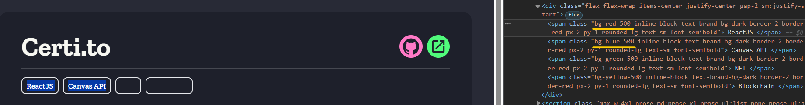

While developing this website, I came across a problem where I wanted to change the tag color sequentially based on an array of colors.

```js
const colors = ['red-500', 'blue-500', 'green-500', 'yellow-500', 'pink-500'];
```

```js
technologies.map((technology, idx) => (
  <span class={`bg-${colors[idx % colors.length]} ...`}>{technology}</span>
));
```

But, when I checked the preview, I found that the color is not changing even though the class is being added.



This happens because TailwindCSS removes any unused classes by default, i.e., classes that are not explicitly written in your html. So, to fix this, we have two options:

### 1. Safelist:

TailwindCSS provides a `safelist` option in the `tailwind.config.js` file, which allows you to specify the classes that you want to keep when purging unused classes.

```js
module.exports = {
  safelist: [
    'bg-red-500',
    'bg-blue-500',
    'bg-green-500',
    'bg-yellow-500',
    'bg-pink-500',
  ],
};
```

### 2. Faster Hack:

Another way to fix this is to add a dummy element to your html, and add the classes to it. This way, TailwindCSS will not remove the classes. Just don't forget to **hide** the element.

```html
<div
  class="hidden bg-red-500 bg-blue-500 bg-green-500 bg-yellow-500 bg-pink-500"
></div>
```

At the end, I went with the second option because it's faster and easier to implement. But, if you have a lot of classes, then you should go with the first option.


